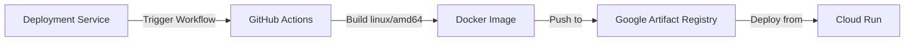

# GitHub Actions Setup for Free Cross-Platform Docker Builds

This guide helps you configure GitHub Actions as a **FREE** alternative to Google Cloud Build for building linux/amd64 Docker images.

## Benefits
- ✅ **100% FREE** for public repos (unlimited builds)
- ✅ **FREE tier** for private repos (2,000 minutes/month)
- ✅ Native linux/amd64 support (no Apple Silicon issues)
- ✅ Built-in caching for faster builds
- ✅ No Cloud Build costs (~$0.003 per build saved)

## Prerequisites
1. GitHub repository for your code
2. Google Cloud project with Artifact Registry enabled
3. Service account for GitHub to push images to GCR

## Setup Steps

### 1. Create Google Cloud Service Account

```bash
# Create service account for GitHub Actions
gcloud iam service-accounts create github-actions \
    --display-name="GitHub Actions Builder"

# Grant Artifact Registry writer permission
gcloud projects add-iam-policy-binding ${GCP_PROJECT_ID} \
    --member="serviceAccount:github-actions@${GCP_PROJECT_ID}.iam.gserviceaccount.com" \
    --role="roles/artifactregistry.writer"
```

### 2. Set up Workload Identity Federation (Recommended - No Keys!)

```bash
# Create Workload Identity Pool
gcloud iam workload-identity-pools create "github" \
    --location="global" \
    --display-name="GitHub Actions Pool"

# Create Workload Identity Provider
gcloud iam workload-identity-pools providers create-oidc "github-provider" \
    --location="global" \
    --workload-identity-pool="github" \
    --display-name="GitHub Provider" \
    --attribute-mapping="google.subject=assertion.sub,attribute.actor=assertion.actor,attribute.repository=assertion.repository" \
    --issuer-uri="https://token.actions.githubusercontent.com"

# Get the Workload Identity Provider resource name
export WIF_PROVIDER=$(gcloud iam workload-identity-pools providers describe github-provider \
    --location=global \
    --workload-identity-pool=github \
    --format="value(name)")

# Allow GitHub Actions to impersonate the service account
gcloud iam service-accounts add-iam-policy-binding \
    "github-actions@${GCP_PROJECT_ID}.iam.gserviceaccount.com" \
    --member="principalSet://iam.googleapis.com/${WIF_PROVIDER}/attribute.repository/YOUR_GITHUB_USERNAME/kgents" \
    --role="roles/iam.workloadIdentityUser"
```

### 3. Configure GitHub Secrets

Go to your GitHub repository → Settings → Secrets and variables → Actions

Add these secrets:

```yaml
WIF_PROVIDER: projects/PROJECT_NUMBER/locations/global/workloadIdentityPools/github/providers/github-provider
WIF_SERVICE_ACCOUNT: github-actions@PROJECT_ID.iam.gserviceaccount.com
```

### 4. Create GitHub Personal Access Token (For API Triggers)

1. Go to GitHub → Settings → Developer settings → Personal access tokens → Tokens (classic)
2. Generate new token with scopes:
   - `repo` (full control)
   - `workflow` (update GitHub Actions workflows)
3. Copy the token

### 5. Configure Environment Variables

Add to your `.env` or Docker environment:

```bash
# Build Strategy Configuration
BUILD_STRATEGY=github_actions  # or "cloud_build" for Google Cloud Build

# GitHub Configuration (for triggering workflows)
GITHUB_TOKEN=ghp_your_personal_access_token
GITHUB_OWNER=your-github-username
GITHUB_REPO=kgents
```

## Usage

### Automatic Triggering

When `BUILD_STRATEGY=github_actions`, the deployment service will:
1. Create a tarball of the Docker build context
2. Trigger the GitHub Actions workflow via API
3. Wait for the build to complete
4. Deploy the built image to Cloud Run

### Manual Triggering

You can also manually trigger builds from GitHub:

1. Go to Actions → Build Agent Docker Image
2. Click "Run workflow"
3. Fill in:
   - `deployment_id`: Your deployment ID
   - `image_tag`: Full GCR image path
   - `build_context`: Base64 encoded tar.gz of Dockerfile + files

## How It Works



## Cost Comparison

| Build Method | Cost per Build | Monthly Cost (100 builds) |
|-------------|---------------|------------------------|
| Google Cloud Build | ~$0.003 | ~$0.30 |
| GitHub Actions (Public) | **FREE** | **FREE** |
| GitHub Actions (Private) | **FREE** (within 2000 min/month) | **FREE** |

## Monitoring Builds

### Via GitHub UI
1. Go to your repository → Actions tab
2. Click on "Build Agent Docker Image" workflow
3. View real-time logs

### Via API (Programmatic)
The deployment service automatically polls the GitHub API to check build status.

## Troubleshooting

### Build Fails with "Unauthorized"
- Check Workload Identity Federation setup
- Verify service account permissions
- Ensure repository name matches in IAM binding

### Workflow Not Triggering
- Verify GITHUB_TOKEN has `workflow` scope
- Check branch name (default: main)
- Ensure workflow file exists in `.github/workflows/`

### Build Context Too Large
- GitHub has a 65KB limit for workflow inputs
- Consider using artifact upload for larger contexts
- Or use Google Cloud Storage for build context

## Security Best Practices

1. **Use Workload Identity Federation** - No service account keys needed!
2. **Limit token scopes** - Only grant necessary permissions
3. **Use GitHub Secrets** - Never commit credentials
4. **Enable branch protection** - Prevent unauthorized workflow changes
5. **Review workflow runs** - Monitor for suspicious activity

## Alternative: GitHub-Hosted Runners

For even simpler setup, you can use GitHub's hosted runners directly in your CI/CD:

```yaml
on:
  push:
    branches: [main]

jobs:
  deploy:
    runs-on: ubuntu-latest
    steps:
      - uses: actions/checkout@v4
      - uses: docker/setup-buildx-action@v3
      - uses: google-github-actions/auth@v2
        with:
          workload_identity_provider: ${{ secrets.WIF_PROVIDER }}
          service_account: ${{ secrets.WIF_SERVICE_ACCOUNT }}
      - run: |
          docker buildx build --platform linux/amd64 \
            --tag us-central1-docker.pkg.dev/$PROJECT/repo/image:latest \
            --push .
```

This approach builds on every push to main branch automatically!
